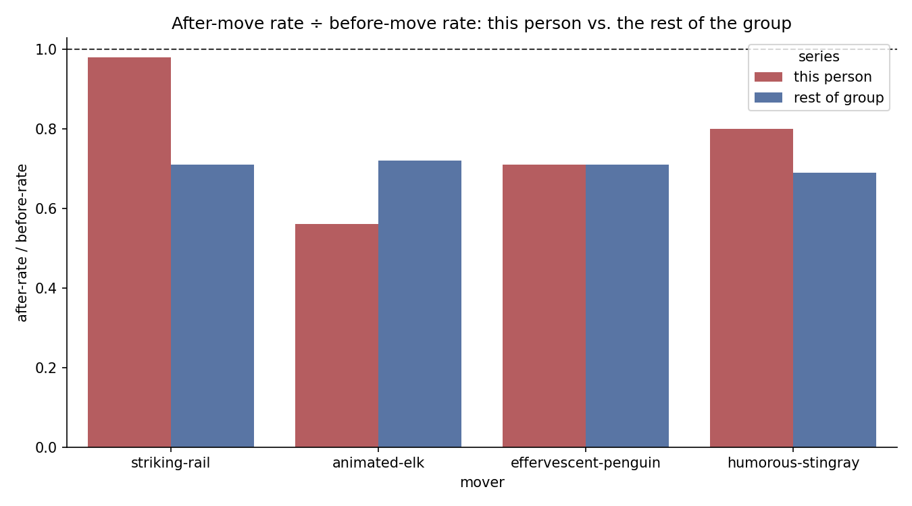

# Moving to the city didn't make people less active — not consistently

*Data: our WhatsApp export, Aug 2020 – Aug 2026. Full pipeline:
[`07-city-move-distribution.ipynb`](07-city-move-distribution.ipynb).*

## The question

Four of us moved to the city at known dates during the export window. My
prediction, before looking: moving to the city means more things to do, a
new social life competing for attention — so each person's daily message
rate in the group chat should drop after their move, more than the group's
rate drops generally.

**The guard against the obvious confound:** this chat's overall volume has
been declining since lockdown ended (Analysis 1), so a simple before/after
dip proves nothing on its own — it could just be everyone slowing down.
Each mover's own after/before rate ratio (fit via Poisson/negative binomial,
the `04.2`/`04.4` technique) is compared against the **rest of the group's**
ratio over the identical calendar window, not read in isolation.

## What the numbers show

| mover | own ratio | group's ratio (same window) | relative to group |
|---|---|---|---|
| striking-rail (me) | 0.98 | 0.71 | **1.38 — no extra decline** |
| animated-elk | 0.56 | 0.72 | **0.78 — declined more than the group** |
| effervescent-penguin | 0.71 | 0.71 | **1.00 — exactly the group's trend** |
| humorous-stingray | 0.80 | 0.69 | **1.16 — slightly less decline** |

The group's own rate dropped ~30% across every one of these windows
regardless of who moved (0.69–0.72 consistently) — a nice consistency check
on Analysis 1's declining-trend finding. Against that baseline, only one of
four movers (`animated-elk`) shows a move-specific extra decline. One
(`effervescent-penguin`) tracks the group exactly. My own data
(`striking-rail`) shows essentially **no decline at all — flat, against a
group that dropped 30% around me**, the opposite of what I predicted.

## Verdict

**Not supported as a uniform pattern.** 1 of 4 movers matches the
prediction, 1 is neutral, 2 contradict it — including my own case. Moving
to the city doesn't have a consistent effect on how much someone posts in
this group chat; whatever drives `animated-elk`'s bigger decline, it isn't
something all four movers share.

## What this check did not do

- My own "before" window is only ~1 year (move was closest to the export's
  start) vs. 2–3 years for the other three — a shorter, noisier baseline.
- No formal permutation/null test run — the group-comparison ratio serves
  as the control here, given the tight time budget for this second pass;
  a proper shuffle test (like Analysis 8's) would give a real p-value
  instead of just "bigger or smaller than the group."
- n=4 movers — this describes these four people, not a general "moving to
  a city" effect.
- Didn't dig into *why* `animated-elk` differs (a specific concurrent life
  event, a relationship, something else) — flagged, not investigated.
