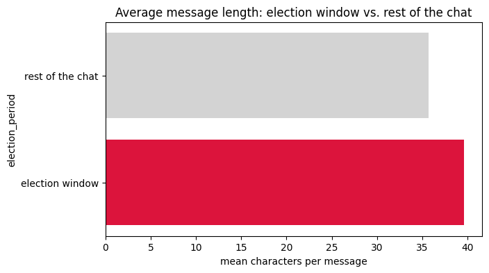
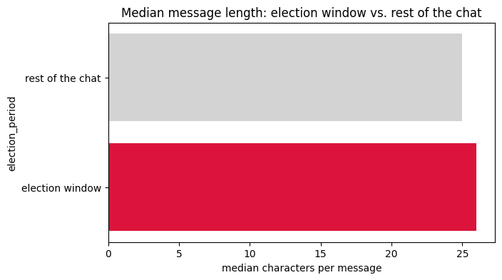
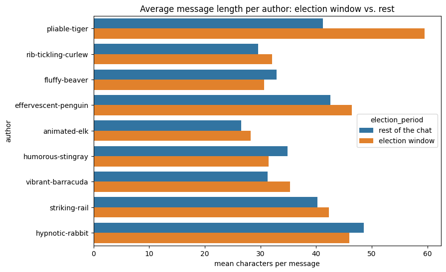
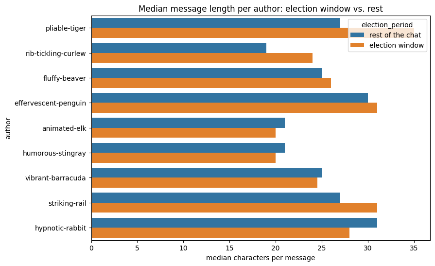
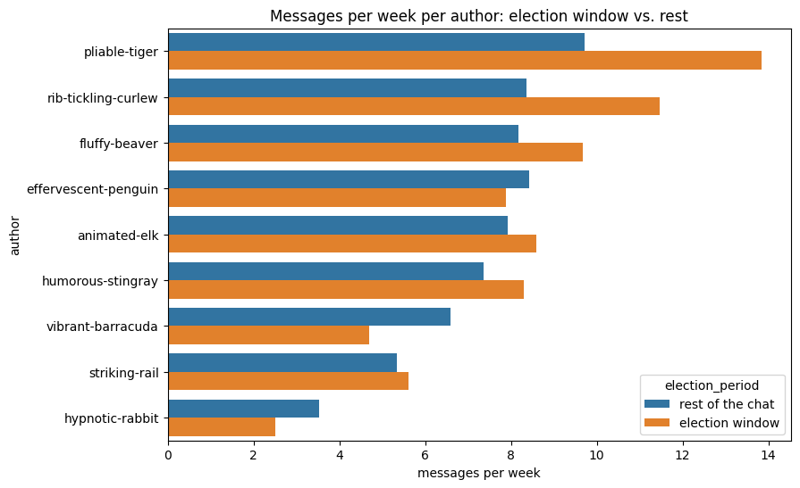
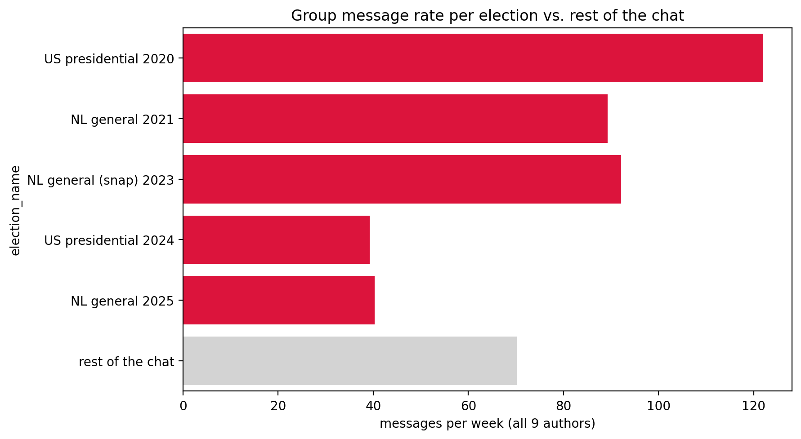
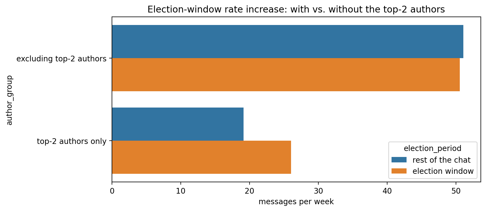
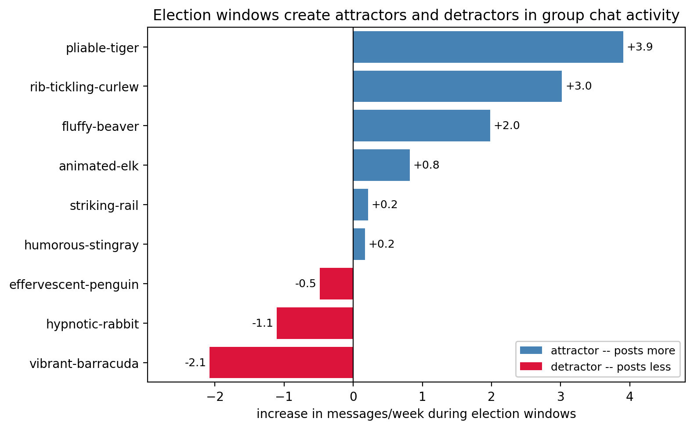
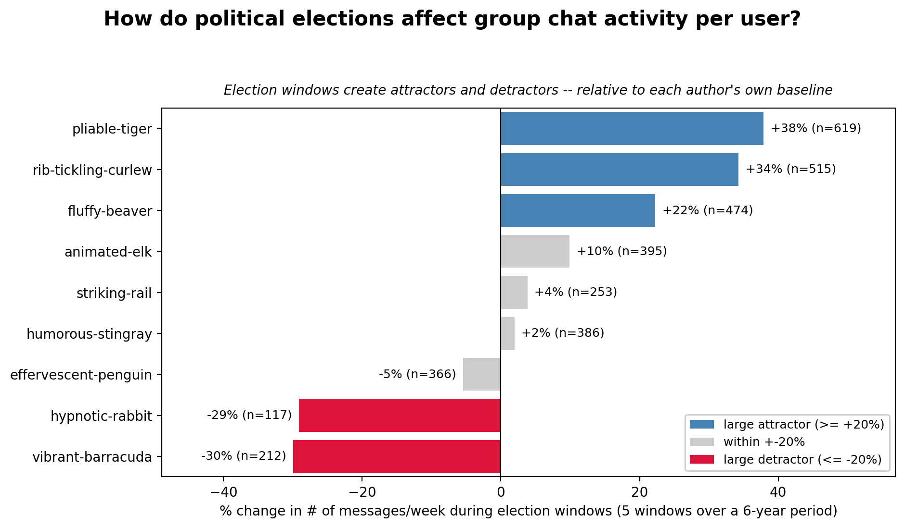

# Do we write longer messages during elections?

*Data: our WhatsApp export, Aug 2020 – Aug 2026 (9 people, ~22.5k messages). Full
pipeline and charts: [`02-election-length.ipynb`](02-election-length.ipynb).*

## The question

I remembered election periods in this chat as more argumentative — the normal
rhythm here is short, efficient "who's in tonight?" planning messages, and I
suspected that around elections the chat shifts toward longer, more
opinionated messages about politics.

**The proposition I set out to test:** average message length is higher inside
election windows (±30 days around each of 5 elections since 2020: two Dutch,
two US, one Dutch snap election) than outside them.

**Named up front, before looking:** if this were true just because one person
always writes long messages regardless of period, that wouldn't be a finding —
it would have to show up as a shift tied to the period, not a fixed personal
trait.

## What the chart actually shows

The pooled averages do show a gap — 39.6 characters per message during
election windows vs. 35.7 outside them. On its own, that looks like it
supports the proposition.

But the same comparison using the median tells a different story:

26.0 vs. 25.0 characters — barely any difference at all. Reporting only the
mean would have overstated this; a handful of long messages are pulling the
average up without most messages actually getting longer.

## Checking whether it's a group pattern or one person

That mean/median gap was already a warning sign, so I split the same
comparison per author:

One person, `pliable-tiger`, jumps from about 41 to about 59 characters per
message during elections — by far the largest mover, and the one carrying
most of the pooled mean's gap. The other 8 people show small differences in
both directions, no consistent pattern. The median-per-author view is messier
still, with no one person standing out as clearly:

## Is even that one person's jump a real effect?

`pliable-tiger` also happens to be the highest-volume author overall, and
their election-window jump could just as easily mean "posts more when there's
more going on" as "writes longer messages when debating." To check, I looked
at message *rate* (messages per week, since the election windows and the rest
of the chat cover very different numbers of calendar days) per author:

`pliable-tiger` goes from 9.7 to 13.8 messages per week during election
windows — a real jump in how *often* they post, not just how long each
message is. `rib-tickling-curlew` shows the same pattern (8.4 → 11.5), while
a couple of others (`vibrant-barracuda`, `hypnotic-rabbit`) actually post
*less* during elections.

## Checking whether the pattern is real

- **What would "nothing interesting" look like?** Message length not really
  differing by election window for anyone, `pliable-tiger` included — the
  jump being noise.
- **How many comparisons did I look at?** I looked at all 9 authors' bars and
  `pliable-tiger` is the one that stood out after seeing all of them, not one
  I suspected going in. That's a real multiple-comparisons risk worth naming,
  not "the one comparison I made."
- **Is there a more likely explanation?** Yes — the messages-per-week chart
  above points to a volume/composition effect (`pliable-tiger` simply posts
  more during elections, and posting more naturally includes some longer
  messages) rather than a genuine "writes longer messages when debating"
  behaviour change.
- **Does the jump look like a fluke reading of a noisy baseline?** Probably
  not — `pliable-tiger`'s own rest-of-chat message length (~41 chars) is
  unremarkable, in line with peers like `humorous-stingray`, `striking-rail`,
  and `effervescent-penguin`. The election-window jump is a real deviation
  from that person's own baseline, which makes it more likely to be a genuine
  (if narrow) signal than noise.

## Verdict

**The proposition, as a claim about the group, is not supported.** The pooled
mean/median disagreement was the first sign, and the per-author chart
confirmed it: the apparent effect is carried by one person, not a shift in
how the group as a whole communicates. Even that one person's jump is better
explained as posting more often during elections than as writing longer
messages specifically.

If there's a finding here at all, it's narrow and personal: `pliable-tiger`
appears to engage more (in volume, and somewhat in length) during elections.
That's not a group-chat-dynamics story, and I'm treating it as a minor,
unconfirmed aside rather than a conclusion.

## What this check did *not* do

- No held-out slice or residual check — time budget went into the four
  charts and the follow-up rate check instead.
- The multiple-comparisons risk (picking `pliable-tiger` out of 9 authors
  after looking, not before) was named but not corrected for statistically.
- Election window boundaries are the same approximate, unvalidated ±30-day
  guess used throughout this project.
- "How rare would this be by chance" was judged by eye, not computed with an
  actual shuffle test.

---

# Follow-up: is the *group* itself more active during elections?

The messages-per-week chart above was only meant to diagnose the length
finding, but it raised a question of its own: is the whole group simply more
active during elections, not just longer-winded? That deserved its own
proper check rather than reading too much into a diagnostic chart.

**The proposition:** group message rate is higher during election windows,
and that increase is concentrated in the two already highest-volume authors
(`pliable-tiger`, `rib-tickling-curlew`) rather than being broad-based.

**Worth naming honestly:** this idea came from looking at the data, not from
memory of the group — so it needed an independent check, not just a second
look at the same chart.

## Chart 1: does it hold across all 5 elections?

No. Three of the five elections (US 2020, NL 2021, NL snap 2023) sit above
the baseline rate (70.1 messages/week) — but the two most recent elections
(US 2024, NL 2025) sit clearly *below* it. My first instinct was that
elections became "less of a talking point" over time. But I'd already
noticed, from the lockdown-activity chart, that this chat has generally been
quieter in later years for reasons that have nothing to do with elections.
Since this chart compares each election to one pooled six-year baseline, it
can't tell "elections stopped mattering" apart from "the whole chat got
quieter" — those would look identical here. I'm leaving this open rather
than claiming either one.

## Chart 2: is the increase really just two people?

Yes. Excluding `pliable-tiger` and `rib-tickling-curlew`, the remaining
seven authors show essentially no difference (51.0 vs. 50.6 messages/week).
The two of them alone go from 19.1 to 26.0. This part holds up well — though
it shares the same underlying risk as chart 1: those two could simply have
been more active in the earlier years, when most of the "positive" elections
happened, independent of election status specifically.

## Verdict

Left in real doubt rather than confirmed. The concentration finding (chart
2) is solid; the "elections matter less over time" reading of chart 1 is not
— it's confounded with a general activity decline this chat already shows
for unrelated reasons. Properly separating the two would mean comparing each
election to its own local surrounding weeks rather than one pooled baseline,
which I didn't have time for tonight.

## A presentation version of the concentration finding

For showing chart 2's finding in class, I redrew it as a single, focused
chart rather than the four-bar grouped comparison above — one bar per
author, so every person's own change is visible rather than only two
pre-picked names against an aggregate.

Colouring only `pliable-tiger` and `rib-tickling-curlew` (my first attempt)
turned out to be a bit misleading on its own — `fluffy-beaver` and
`vibrant-barracuda` also move by a real amount, just in different
directions. Rather than hide the other seven behind a single "everyone
else" bar, I reframed the claim itself: election windows create
**attractors and detractors** — some people engage more, some less — with
colour now marking each bar's own direction rather than two names chosen in
advance.

Since a fixed number of extra messages means more for someone who barely
posts than for someone who already posts a lot, I also built a version
relative to each person's own baseline, with an explicit ±20% cutoff for
what counts as "large" (chosen after seeing the data split cleanly around
that line, not picked blind), and each bar's election-window message count
shown directly so a reader can judge for themselves how much a given
percentage is resting on:

This version changes the picture in one real way: `hypnotic-rabbit`'s drop
looked minor in absolute terms (−1.1 messages/week) but is proportionally
almost as large as `vibrant-barracuda`'s (−29% vs. −30%) — it's just a much
smaller sample to begin with (n=117 election-window messages, the smallest
of the nine), which is exactly the kind of thing worth saying out loud
rather than glossing over.
