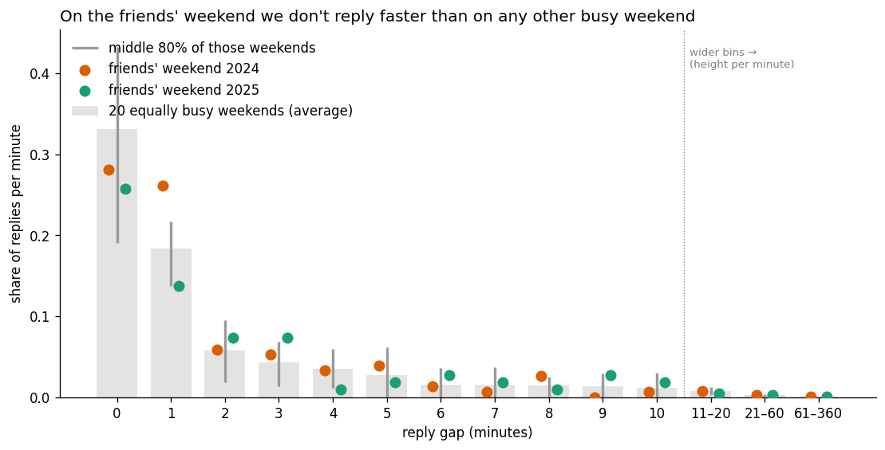

# On the friends' weekend we don't reply faster than on any other busy weekend

*Data: our WhatsApp export, Aug 2020 – Sep 2026 (9 people). Full pipeline:
[`09-friends-weekend-reply-gap.ipynb`](09-friends-weekend-reply-gap.ipynb).*

## The question

Once a year we go away together for a weekend (2024 and 2025 are in the
export). An earlier analysis showed the chat gets much busier around it. My
feeling was that it also gets *faster*: when we're together there's something
to coordinate ("where are you?", "want a drink?"), so we answer each other
quicker.

**What I measured:** the **reply gap**, the minutes between someone's last
message and the next message by *someone else*. A gap of more than 6 hours
counts as a new conversation, not a slow reply. For each Friday–Sunday I took
the median reply gap of that weekend.

**Fair comparison, decided before looking:**

- **Only other Friday–Sunday weekends.** Everyone replies faster outside work
  hours, so comparing with weekdays would make any weekend look fast.
- **Only weekends that are just as busy** (at least 50 replies). A busy chat
  means rapid back-and-forth, and our friends' weekends were the busiest and
  5th-busiest of all 289 weekends. That leaves 20 comparable weekends.
  Weekends with a birthday or another group trip (Groningen) are left out.
- **The test:** both friends' weekends must be faster than 80% of those
  comparable weekends.

## What the chart shows

For every reply gap (0, 1, 2 … minutes; wider bins after 10 minutes) the
chart shows the share of replies. Grey bars are the average busy weekend, and
the grey whiskers show where the middle 80% of those weekends fall. If the
friends' weekends were faster, their dots would sit above the whiskers on the
left (0–1 minutes).

They don't. Almost every dot sits inside the normal range. 2025 is even a bit
slower at 0 and 1 minutes.

| | median reply gap | busy weekends it beats | needed |
|---|---|---|---|
| Friends' weekend 2024 | 1 min | 50% | 80% |
| Friends' weekend 2025 | 3 min | 25% | 80% |

## Does it depend on where I draw "busy"?

No. With a looser line (≥ 30 replies, 67 weekends) the friends' weekends beat
69% and 43%. With a stricter line (≥ 75, 10 weekends) they beat 30% and 10%.
Neither ever reaches 80%. The friends' weekends were still busier than most
comparison weekends, and busier means faster, so that difference would help my
idea. Even with that help, they don't stand out.

## Verdict

**Not supported.** The friends' weekend makes us send *more* messages, but we
don't reply *faster* than on any other busy weekend. Speed seems to come with
being busy, not with being together.

## What this check did *not* do

- **n = 2 weekends.** This describes our two weekends, not a rule; the claim
  is *not detectably faster*, not proof that there is no effect.
- **Timestamps are whole minutes.** 23% of replies have a gap of 0 minutes, so
  small differences can't be seen.
- **2024 had an accident** (someone fell), which brought worried messages;
  not checked separately.
- **Only the weekend itself was tested**, not the planning weeks before.
- **2024 has more 1-minute replies than usual.** That is one of 28 dots on
  the chart, and with an 80% range you'd expect 5–6 outside it by chance, so
  it isn't a finding.
- **Many things were looked at this session** (several measures, four
  sketches, three "busy" lines). That doesn't weaken a null, but nothing found
  along the way counts as a finding without new data.
