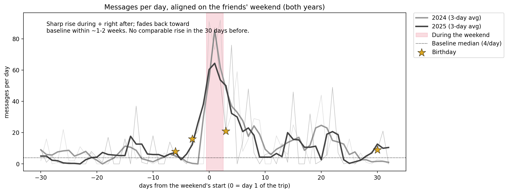
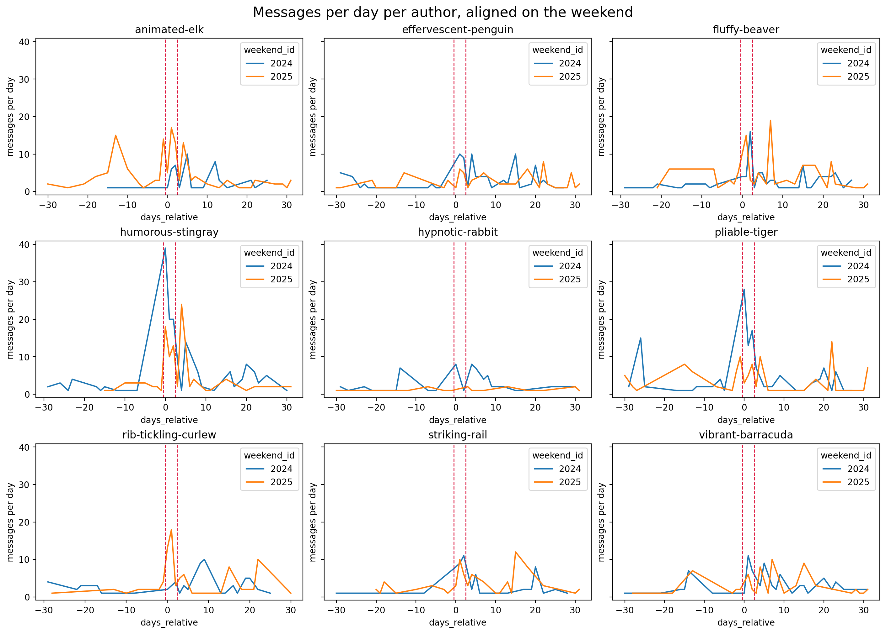
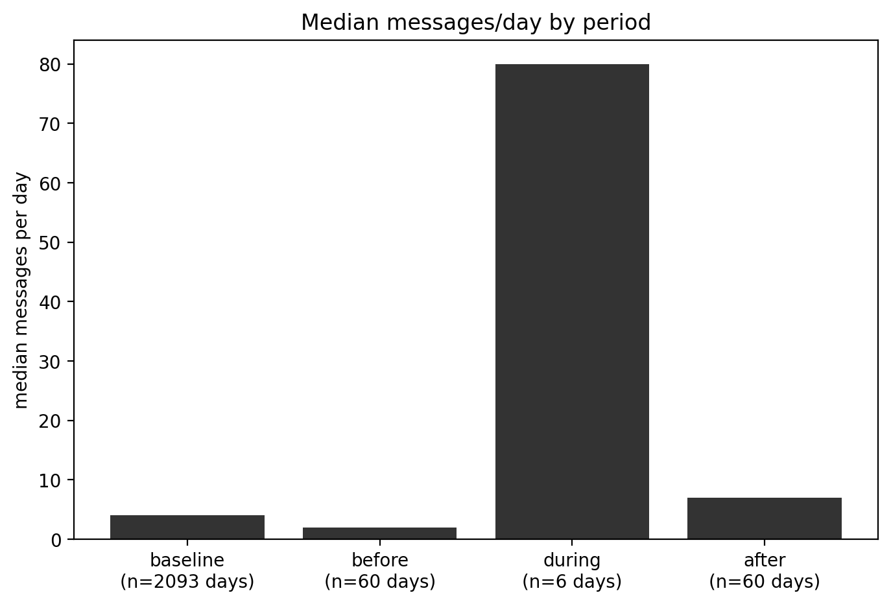

# Does the annual friends' weekend show up in the group chat?

*Data: our WhatsApp export, Aug 2020 – Aug 2026 (9 people, ~22.5k messages). Full
pipeline and charts: [`05-friends-weekend-activity.ipynb`](05-friends-weekend-activity.ipynb).*

## The question

Since 2024 we've had an annual friends' weekend away — everyone in the group
attended both times (Apr 19–21, 2024 and Sep 19–21, 2025). My suspicion, from
having actually been there, was that the chat would show it: a build-up of
planning messages in the weeks before, elevated chatter during the trip
itself, and a bump afterwards from photos and callbacks, before settling back
to normal.

**The proposition I set out to test:** message volume is higher than the
group's normal baseline in the ~2 months before the weekend and during the
weekend itself, and stays elevated for about a week after, before returning
to baseline.

**Named up front, before looking:** "people text more while physically
together, then it fades" is true of basically any group on any trip — not
specific to this one. The real question is whether the *shape* (build-up,
sustained-not-dipping during, afterglow) looks the way I expected it to, not
just whether there's a bump somewhere.

## What the chart actually shows

Both years aligned on "day 0 = the trip's first day," so the five months
between April 2024 and September 2025 collapse onto the same axis. The raw
daily counts are the faint lines in the background; the bold line is a 3-day
rolling average, added after the raw version looked too spiky to read
cleanly, but without deleting the actual spikes — they're still visible,
just not the loudest thing on the page.

The pattern: a sharp rise right around the trip that peaks during the pink
"during" band, then decays back toward the dotted baseline line over roughly
1–2 weeks. **What's missing is the month-long build-up I expected** — the 30
days before the trip sit at or below the group's normal baseline, with only
a small ramp in the final few days before departure, not a sustained
anticipation effect.

The gold stars mark three of the group's birthdays that happen to fall near
one of the two weekends — flagged rather than removed, so it's clear which
bumps are a birthday and which aren't (one of them, at day −6, sits well
outside the actual trip-related rise).

## Checking whether it's the whole group or a couple of people

The during/after spike shows up across essentially all 9 people, not one or
two — this looks like a real group-wide pattern, not something one talkative
person is driving.

## Checking the "before" gap wasn't just the window I picked

I widened the after-window from 7 to 30 days and narrowed the before-window
from 60 to 30, to see more of the after-period's shape and check the result
wasn't an artifact of the specific widths I'd first picked:

Both window widths told the same story: **before stays flat (median 2.0,
actually below the overall baseline of 4.0), during spikes hard (80.0), and
after is real but fades** — a 7-day after-window shows a median of 20.5, but
widening it to 30 days pulls that down to 7.0, meaning the afterglow is
concentrated in the first week or so, not sustained for a month.

I also checked whether the missing "before" rise could be hiding in a
day-of-week pattern — e.g. ordinary "who's free this weekend?" Friday
chatter that happens most weeks anyway, not something trip-specific. It
isn't: the before-window's Friday median (7.5) is only mildly above the
chat's overall Friday median (5.0), and its Saturday median (3.5) is
actually *below* the overall Saturday median (8.0). No clean day-of-week
story rescues the "before" half of the original idea.

## Checking whether the pattern is real

- **What would "nothing interesting" look like?** No significant increase in
  messages during, before, or after these weekends — daily counts just being
  this chat's normal noisy/spiky behaviour, unrelated to the trip.
- **How many comparisons did I look at?** Only two window-width combinations
  (60-before/7-after, then 30/30) — both agreed on the same shape, so this
  isn't a "best of many tries" result.
- **How rare is a spike this size, really?** I'd assumed spikes this size
  happen fairly often in this chat — from things like football matches — so
  I checked it directly instead of guessing. I excluded every day inside
  either weekend's own before/during/after window, then looked at every
  possible 3-day stretch across the remaining ~6 years of the chat (2091
  windows). **None of them reach the real during-weekend median of 80
  messages/day** — the closest is 69, from a window in August 2022. The
  during-weekend spike is the single most extreme 3-day stretch in this
  chat's entire history, which is stronger evidence than I expected going
  in.
- **Is there a more likely explanation?** Two live candidates, not
  investigated further this round: 2024's after-window includes a member's
  accident (a fall, facial scar) — plausibly inflating that year's after-bump
  with concern/check-in messages rather than pure "positive interaction."
  And the plain "people are excited when physically together" explanation
  from the start — which the data can't distinguish from a more specific
  "this particular group, this particular trip" story.
- **Does it hold up on data I didn't use to find it?** There's a genuine
  third occurrence of this weekend in real life, which would have been the
  natural held-out check — but it falls after this chat export's last
  message, so it isn't available yet. As a partial substitute, both years
  individually show the same rise-and-decay shape rather than one year
  carrying the whole pattern.

## Verdict

**Partially supported.** The during-weekend spike is real and verified as
genuinely unusual, not ordinary chat noise — it's the most extreme 3-day
stretch in six years of this chat. The after-effect is real too, but
short-lived, mostly faded within 1–2 weeks rather than lasting a month. The
**before** half of my original idea — a month of building excitement — isn't
supported at either window width I tried; if there's any anticipation
effect at all, it's a ramp in the final few days before leaving, not a
sustained one. So the honest version of the finding is narrower than what I
set out to test: **the group shows up hard for the trip and its immediate
afterglow, but doesn't spend weeks visibly anticipating it in the chat.**

## What this check did *not* do

- Only 2 weekend events exist in the data — everything here describes these
  two specific trips, not a proven yearly pattern.
- The two named confounders (2024's accident, plain in-person excitement)
  were flagged but not separated out — I can't currently tell "this specific
  group's bond" apart from "any group on any trip."
- No proper held-out check — the natural third occurrence hasn't happened
  yet in the data.
- Window widths were sensitivity-checked (60/7 vs. 30/30) but not swept
  exhaustively across every possible width.
