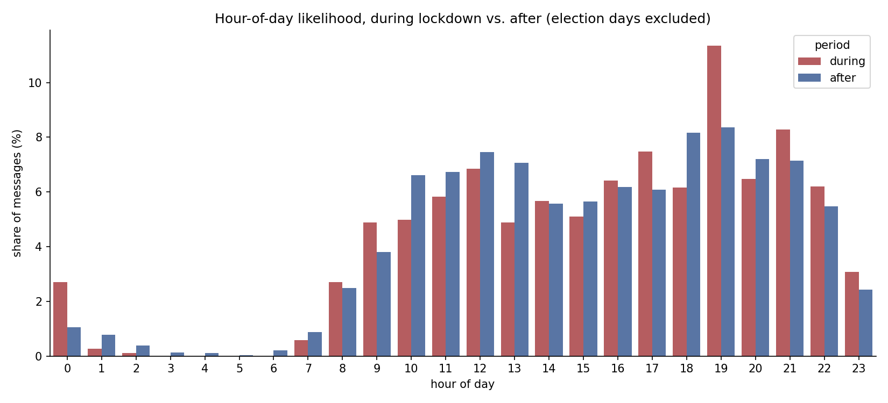
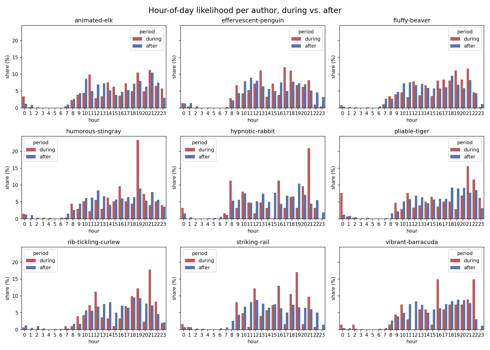
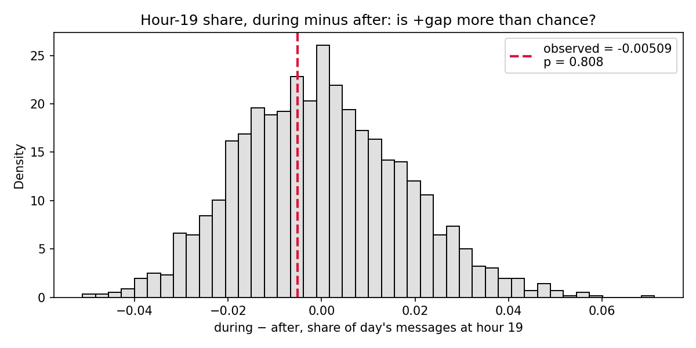

# Lockdown didn't reshape our daily rhythm — one night did

*Data: our WhatsApp export, Aug 2020 – Aug 2026 (9 people, ~22.5k messages). Full
pipeline and charts:
[`06-lockdown-hour-of-day.ipynb`](06-lockdown-hour-of-day.ipynb).*

## The question

This was the parked idea from my very first analysis (lockdown volume over
time): a *sustained trend* is one thing, but does the COVID lockdown period
show a different **daily rhythm** — not just "more messages," but messages at
different hours?

**My prediction, before looking:** working from home removes the
commute/office schedule. During lockdown I expected daytime hours to gain
share (nothing stopping people from chatting at 11am) and late-night hours to
gain share (able to stay up later). After lockdown, back to a structured work
day, I expected the opposite — less daytime, more evening.

**Falsification:** if the hour-of-day shape looks basically the same during
lockdown and after, that says no.

## What the chart actually shows

Every hour (0–23) is forced onto the axis even where a period had zero
messages, and the y-axis is share of that period's messages, not raw count —
`during` (111 days, pooled across both NL lockdown windows) and `after`
(1,087 days) have very different totals, so raw counts wouldn't be
comparable.

The first surprise: **the shape is mostly the same, and where it differs, it's
the opposite of my prediction.** Daytime and late-night hours didn't gain
share during lockdown. Instead, two evening hours — 19 and 21 — stood out as
higher during lockdown, with daytime hours (10, 13) *lower*. My first
explanation, on reflection: maybe it's not "lockdown freed up the daytime," but
"the after-period normalized using the phone *during* work hours" (hybrid work
habits that outlasted the lockdown itself).

## Ruling out one person driving it

The elevated-evening pattern shows up for most of the 9 people, not just 1–2 —
this isn't one chatty person's habit being mistaken for a group pattern.

## Catching a confound: election nights

Hour 21's gap looked like the standout at first (+4.3 percentage points). But
this chat's own election-date list (from an earlier analysis) has 5 elections
in it, and one — the 2021 Dutch general election — falls right inside the
lockdown window. Checking it directly: **86 of the 242 hour-21-during
messages (35.5%) came from that single date, 2021-03-17.**

Rather than only stripping that one day from `during` (a one-sided fix), I
checked whether any of the other 4 elections fell inside the `after` window
too — one does (2023-11-22, 68 messages that day). Both real election days
got excluded, one from each side, for a fair comparison:

- **Hour 21's gap collapsed from +4.3pp to about +1pp** — most of it was the
  election, not lockdown.
- **Hour 19's gap barely moved** (+2.9pp → ~+3.0pp) — not an election
  artifact.

That's the chart above — the corrected version. Revised headline, narrower
than my first read: if there's a real lockdown effect here, it's centred on
**hour 19**, not both 19 and 21.

## Checking whether hour 19's gap is real, or still noise

The pooled comparison above lets a busy day count more than a quiet one — a
day with 50 messages outweighs a day with 1 message 50-to-1. To check
whether the +3pp gap survives when every *day* counts equally (matching the
independent-units logic from the group-size check earlier), I shuffled the
during/after label across days 2,000 times and compared the real gap to the
shuffled cloud.

**It didn't survive.** Observed gap: essentially zero (−0.005). Two-sided
p = 0.81 — the real value sits comfortably in the middle of the null cloud,
not out in a tail.

**Why the pooled and day-level views disagree:** most days have *zero*
hour-19 messages at all — 84 of 111 during-days, 792 of 1,087 after-days.
Hour-19 activity isn't a daily habit; it's concentrated on a handful of
unusually active evenings. Checking which during-days actually drive the
pooled hour-19 count: **the top 5 days account for 73.8% of it**, and the
single biggest — 91 messages, more than double the runner-up — is
**2020-12-14, the first day of the lockdown window itself** (almost
certainly the evening the lockdown was announced). The #2 day is Christmas
Eve 2020 (39 messages).

## Verdict

**Not supported as a sustained pattern.** The hour-of-day shape during
lockdown looks close to the shape after it, once two known confounds are
accounted for. What looked like "lockdown shifted our daily rhythm toward
evening chatting" turns out, on closer inspection, to be **two extraordinary
evenings — the lockdown announcement itself, and one Christmas Eve —**
plus one unrelated election night, not a sustained change in when 9 people
chat with each other. The honest version of the finding is narrower and
different from what I set out to test: **lockdown, as a multi-month
condition, didn't measurably change our daily rhythm; a couple of specific
nights just happened to be loud.**

This is a useful result even though the original hypothesis didn't hold —
it's the same lesson the friends'-weekend analysis needed a null check for:
a pooled/aggregate comparison can show an apparent shift that a
unit-of-analysis-aware test shows isn't there once you ask "real, or a
couple of loud days?"

## What this check did *not* do

- Both lockdown windows were pooled into one `during` group — not tested
  separately, so it's possible the two lockdowns behaved differently from
  each other and that's being averaged away.
- 2020-12-14 being "the lockdown announcement evening" is an inference from
  the date lining up with the start of the lockdown window, not verified
  against the actual message content or an external news timeline.
- The per-author check confirmed the *direction* is broad-based, but didn't
  re-run the day-level null test per author — a real effect for a subset of
  the group could still be hiding inside the pooled null result.
- No check on other hours besides 19 and 21 — it's possible a genuine,
  smaller shift exists at an hour that didn't stand out in the raw pooled
  comparison.
- No held-out data: the whole ~6-year export was used to both find and test
  this, the same limitation as the friends'-weekend analysis.

## Next up

Parked for the next distributions-themed pass: look for other candidate
variables/events where a *sustained* distribution shift (not a couple of
loud days) might actually survive a day-level null test — e.g. message
length, day-of-week rather than hour-of-day, or a different event entirely.
