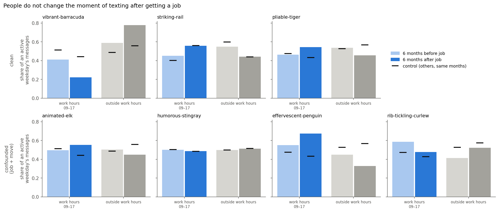
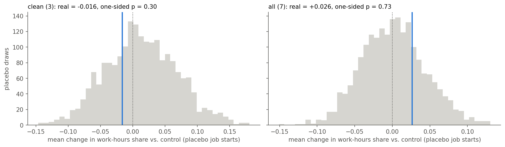

# People do not change the moment of texting after getting a job

*Data: our WhatsApp export, Aug 2020 – Sep 2026 (9 people). Full pipeline:
[`08-job-start-hour-of-day.ipynb`](08-job-start-hour-of-day.ipynb).*

## The question

Seven of us started a job at a known month during the export. My prediction,
before looking: once you work 9-to-5, weekday chatting moves out of work hours
and into the evening.

But an earlier analysis of mine (lockdown vs. after) had already hinted the
opposite — daytime chatting went *up* after lockdown, which I put down to
hybrid work making it normal to be on your phone during the workday. So I set
the question up with two outcomes, both worth reporting, decided before
looking at the data:

> Does starting a job push your chat time from daytime to the evening — or do
> people just keep chatting during work?

**What I measured:** weekdays only (Mon–Fri). For every weekday someone posted,
the share of that day's messages sent between 09:00 and 17:00 — each day
counts once, so one very busy day can't dominate. Compared over the 6 months
before vs. the 6 months after their job start, and against **the rest of the
group over the same months** (only people with no job start or move of their
own in that window). The group changes too, so a person only counts as
shifting if they shift *more than the others*.

## What the chart shows

Top row: the three people whose job start was the only big change at the
time. Bottom row: four people who also moved in with a partner or moved city
within a few months — kept, but not mixed with the clean cases, since those
events can't be separated from the job.

One person (`vibrant-barracuda`) does exactly what I predicted: work-hours
share drops from 41% to 22%, the rest moves to the evening. The others don't:
`striking-rail`'s work-hours share goes *up*, in step with the group's, and
`pliable-tiger`'s goes up while the group's goes down. The bottom row points
both ways.

## Is even that one shift real?

The check: I recomputed the same number for each person at **fake job-start
months** — every month where nothing actually happened to them (25–49 fake
months per person). If a real job start matters, it should stand out from
those ordinary months.

| | real change vs. group | fake months at least as strong |
|---|---|---|
| vibrant-barracuda | −12 pp | 14% |
| striking-rail | −5 pp | 16% |
| pliable-tiger | +12 pp | 88% |
| **three clean starters, averaged** | **−2 pp** | **30% (p = 0.30)** |
| **all seven, averaged** | **+3 pp** | **73% (p = 0.73)** |

It doesn't stand out. Even `vibrant-barracuda`'s shift happens in about 1 in 7
random months for them. Widening the window to 12 months either side makes it
disappear entirely (−12 pp → −1 pp) — so whatever happened there was short.

## Verdict

**The second outcome: people keep chatting during work.** Starting a job did
not measurably change *when* on a weekday we text — the real job starts look
like any other month. My original prediction (chatting moves to the evening)
is not supported.

This fits the hint from the lockdown analysis: for this group, the phone
during the workday seems to be normal, not something a job takes away.

## What this check did *not* do

- **n = 7 people, 3 of them clean.** This describes us, not people in general.
- **Job dates are from memory, to the month.** A start at the end of the month
  puts a few weeks of pre-job days in "after".
- **Thin after-windows:** `pliable-tiger` (25 active weekdays after) and
  `effervescent-penguin` (28) post on few days, so their numbers are noisy.
- **The window matters:** ±6 months was fixed before looking; ±12 is reported
  as a check and changes individual results (e.g. barracuda's shift vanishes).
- **Only the work-hours share was tested.** The chart groups everything else
  as "outside work hours"; whether morning, evening or night changed on their
  own wasn't tested.
- **Not checked on held-out data**, and this was the second question tried in
  the same session (the first — moving in with a partner vs. weekend
  texting — also came back empty; see `analysis-log.md`, Analysis 10).
