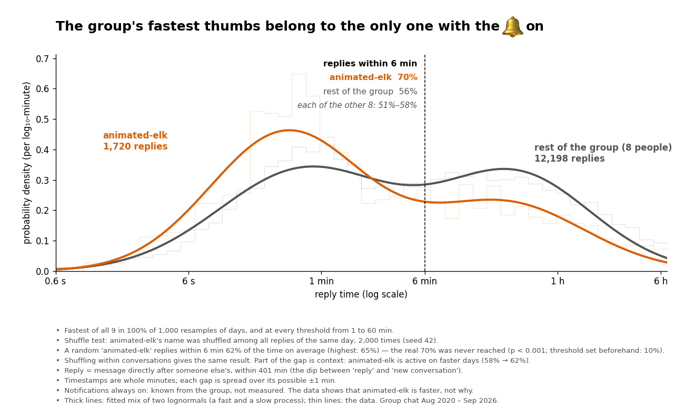

# The group's fastest thumbs belong to the only one with notifications on

*Data: our WhatsApp export, Aug 2020 – Sep 2026 (9 people). Full pipeline:
[`11-reply-speed-elk.ipynb`](11-reply-speed-elk.ipynb).*

## The question

In the group, `animated-elk` is the only one with WhatsApp notifications always
on. From daily experience they seem to answer quickest. Does the data agree?
And what kind of distribution is reply time in the first place?

**What I measured:** the **reply time**, the time between a message and the
next message by *someone else*. Gaps longer than 401 minutes count as a new
conversation, not a slow reply. That's where the distribution has a dip between
its two bumps (replies vs. new conversations).

## What kind of data is reply time?

- **Continuous, recorded in whole minutes.** Time is continuous, but the export
  only stores minutes. Both timestamps are rounded down, so a recorded gap of
  k minutes is really somewhere between k−1 and k+1 minutes. I spread each gap
  over that range instead of pretending a "0-minute" reply took zero time.
- **Heavily skewed.** Half of all replies come within a few minutes, but the
  mean is pulled up by a long tail. So I use a log scale and medians, not means.
- **Not exponential.** If replies came at a steady random rate, reply times
  would follow an exponential distribution. They don't: it fits worst of all
  families tried. A **lognormal** fits best. Per person, a mix of two
  lognormals (a *fast* and a *slow* way of replying) describes the shape better
  still.
- **Not independent.** Fast replies come in bursts, and nights are slower. So
  all uncertainty below comes from resampling whole *days*, not single replies.

## What the chart shows

Both curves are probability densities on a log time axis: where a curve is
higher, more of that person's replies fall in that time range. The orange curve
is higher on the left (seconds to a few minutes) and lower on the right.
`animated-elk` replies within 6 minutes **70%** of the time. The rest of the
group does so 56% of the time, and each of the other 8 people between 51% and 58%.

The difference is in *how often* someone replies in fast mode, not in how slow
the slow replies are. Those are about the same for everyone (around half an hour).

## Is it more than chance?

**Shuffle test (decided before looking, threshold 10%):** I shuffled who sent
each reply, only among replies of the same day, 2,000 times. A random
"animated-elk" then replies within 6 minutes 62% of the time (highest: 65%).
The real 70% was never reached (p < 0.001). Shuffling within conversations
gives the same result.

**Is it a ranking or just a difference?** The title says *fastest*. In 1,000 out
of 1,000 resamples of days, `animated-elk` is the fastest of all 9, and that
holds whether "fast" means within 1, 2, 3, 6, 10, 30 or 60 minutes.

## Is it the bell?

That's my explanation, and the data can't prove it. One test I set before
looking (silences of at least 60 minutes, when nobody has the app open) gave a
split answer:

- **Held up:** after a silence `animated-elk` is still much faster: 3.3× the
  others' speed, against 2.3× within a running conversation. If they were only
  fast because they join lively conversations, this advantage should have gone
  away.
- **Did not hold up:** they are not the first to reply clearly more often
  (1.27× their usual share; I had set 1.5× as the bar).

So: faster, yes; *more*, no.

## Verdict

**Supported.** `animated-elk` replies faster than each of the other 8 members of
the group, within conversations, from 2020 to 2026. It is not chance, and it
doesn't depend on where you draw the line for "fast". The notification bell
fits this well, but it is an explanation from experience, not something this
data measured.

## What this check did *not* do

- **Part of the gap is context.** `animated-elk` is more active on days when
  everyone replies faster: that explains about 4 of the 14 percentage points.
  The rest is theirs.
- **The bell itself was not tested.** That would need a period with the bell
  off, or someone else turning it on.
- **Replies after 401 minutes are left out.** By then a new conversation can
  start, so those are not replies in the same sense.
- **A "reply" is any message after someone else's.** It may not actually
  answer that message.
- **Timestamps are whole minutes.** Below about 2 minutes the exact shape can't
  be seen. The small peak in the data around 1 minute comes from this rounding.
- **Many choices were made along the way** (spreading method, cut, family,
  threshold). The tests and their thresholds were fixed before looking. Other
  patterns noticed along the way are leads, not findings.
