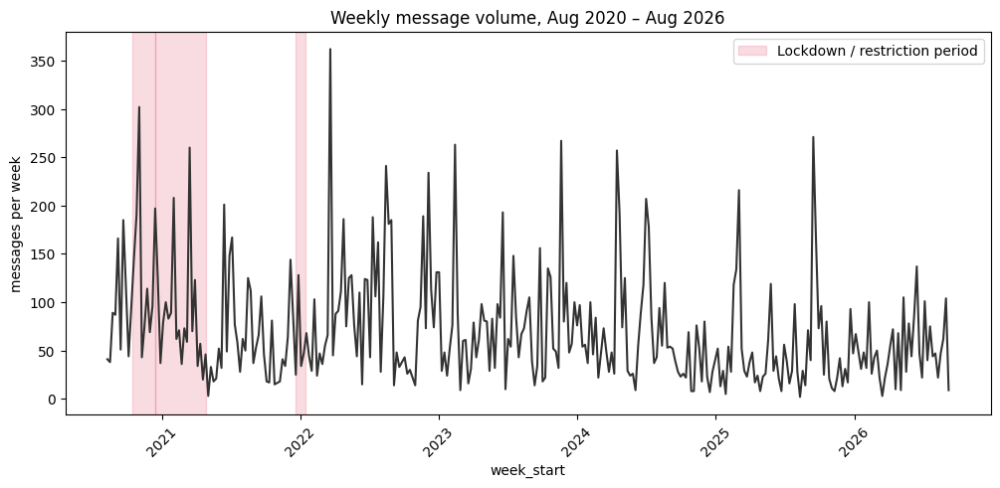
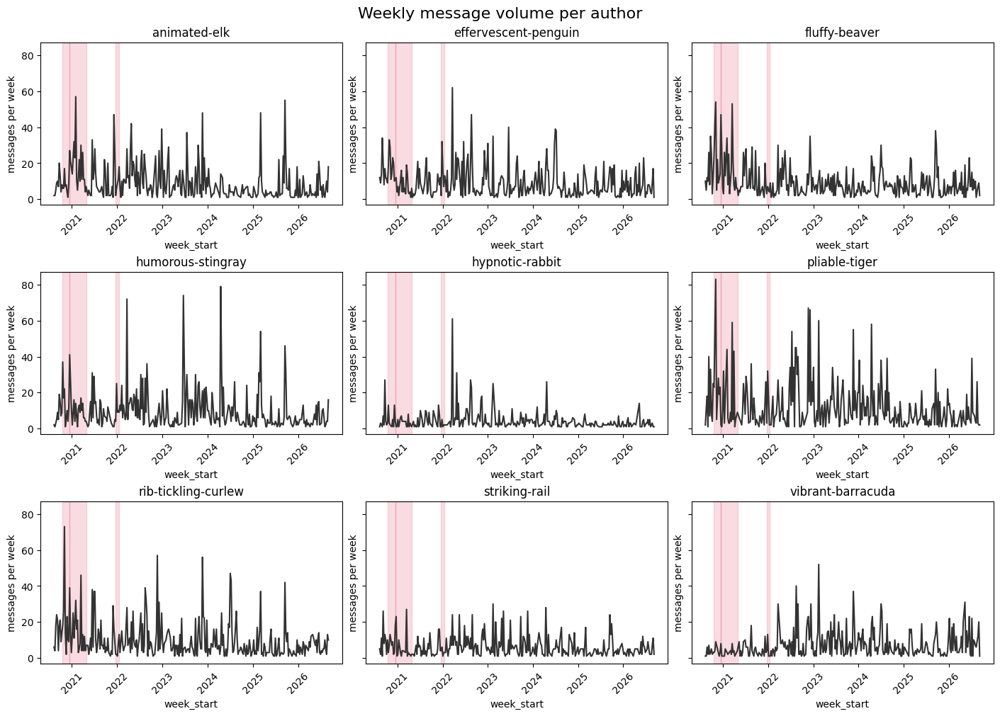

# Was our group chat busiest during lockdown?

*Data: our WhatsApp export, Aug 2020 – Aug 2026 (9 people, ~22.5k messages). Full
pipeline and charts: [`01-lockdown-activity.ipynb`](01-lockdown-activity.ipynb).*

## The question

Going into this, my expectation — from actually having lived through it, not from
looking at the data first — was that this chat would have been busiest during the
COVID lockdowns (2020–2021), and would have quieted down since restrictions lifted.
Suddenly everyone was home, WhatsApp was one of the main ways to stay in touch, and
that felt like it should show up as a clear, sustained bump.

**The proposition I set out to test:** chat activity was highest during the COVID
lockdown periods and has been declining since — not flat, and not increasing.

## What the chart actually shows

Weekly message counts, Aug 2020 – Aug 2026, with the Dutch lockdown/restriction
windows shaded in pink (the first COVID lockdown winter 2020–2021, and the shorter
lockdown at the end of 2021).

Looking at this — away and back, first impression — the first lockdown window
does line up with a real rise, clearly higher than the quieter stretch right after
it in late 2021. But the second shaded lockdown shows nothing comparable. And from
2022 onward, the chart keeps producing spikes of the same size or bigger — 2022,
2023, mid/late 2024, 2025 — none of which are lockdown periods.

The same picture holds up per person (small multiples, one panel per author, same
scale):

Nobody's individual pattern rescues the story — the "spikes everywhere, not just
during lockdown" shape repeats across the group, so it isn't one or two people
skewing the total.

## Checking whether the pattern is real

Before trusting a pattern that partly matched my expectation, I checked it against a
few honest questions:

- **What would "nothing interesting" look like?** Message volume roughly flat and
  noisy over time, with no particular link to lockdown status. That's a plausible
  read of the chart on its own.
- **How often would a random split look this convincing?** Given that similarly
  sized spikes already show up in 2022 and 2023 — periods with no lockdown label at
  all — a shuffled/random set of "special" weeks would likely turn up something
  just as strong fairly often. That undercuts treating the 2020–2021 rise as
  special just because it's the one I expected.
- **Is there a more likely explanation?** A recurring pattern in this chat is that
  bad news — a friend's or family member's illness — sets off a burst of messages,
  regardless of season or restrictions. That is a much better fit for spikes that
  keep recurring in 2022, 2023, and beyond than "we were in lockdown" is, since
  most of those later spikes weren't lockdown periods at all.
- **Does the 2020–2021 rise hold up against other slices of the same data?** The
  rise itself still looks real on its own. But the same size of rise shows up again
  in the middle of 2022, the end of 2022, and the end of 2023 — so whatever caused
  it isn't unique to lockdown; it looks like a recurring kind of event, not a
  sustained COVID-era shift.

## Verdict

**The proposition, as originally stated, is not supported.** Only one of the two
shaded lockdown windows shows a rise, the "declining since lockdown" half never
shows up (volume stays spiky through 2026), and the size of the 2020–2021 rise gets
matched or beaten by later, unlabelled periods. This isn't a plotting problem —
the chart shows what it shows.

What the data points to instead is a **recurring-spike pattern**, plausibly tied to
how this group responds to bad news (illness, family events) rather than to any
calendar period. That's a hypothesis worth testing properly on its own, not a
conclusion — it hasn't been checked with its own falsification test yet.

## What this check did *not* do

Worth being upfront about, since none of this was a formal statistical test:

- No other time splits were tried before lockdown vs. non-lockdown — this was the
  first and only comparison made, so it isn't "the most striking of many
  candidates," but it also hasn't been stress-tested against alternatives.
- The lockdown boundary dates themselves are approximate (flagged from the start),
  not checked against an authoritative source.
- "How often would a random split look this strong" and "does the rise survive on
  a slice I didn't use to find it" were both judged by eye, not computed.
- No trend line or rolling average was fitted, so there's no residual to inspect
  for leftover structure.
